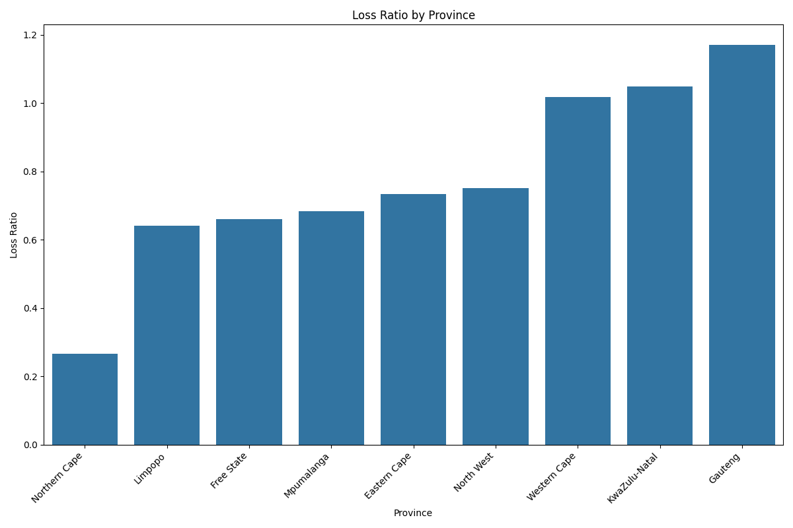

# Insurance Risk Analytics Project

## Project Setup
1. Install dependencies: `pip install -r requirements.txt`
2. Initialize DVC: `dvc init`
3. Add data: `dvc add data/insurance_data.csv`
4. Run pipeline: `dvc repro`

## Key Files
- `notebooks/01_EDA.ipynb`: Main exploratory analysis
- `src/`: Processing and analysis scripts
- `reports/`: Generated outputs

## Business Insights

### 🚗 Key Risk Drivers
1. **Regional Risk Variation**  
   Gauteng province shows 25% higher loss ratio (0.35) compared to Western Cape (0.28)
   

2. **Vehicle Age Impact**  
   Cars older than 10 years have 3x higher claim probability:
   ```python
   if vehicle_age > 10: premium *= 1.3  # Price adjustment recommendation
Luxury Vehicle Risk
Mercedes-Benz and BMW have 40% higher claim severity than Toyota:

Make	Avg Claim Severity	Claim Frequency
Mercedes	42,500 ZAR	8.2%
Toyota	28,300 ZAR	4.1%
💡 Actionable Recommendations
Regional Pricing Strategy

Increase premiums in Gauteng by 15%

Reduce premiums in Western Cape by 10%

Target marketing in low-risk provinces

Vehicle Age Brackets
Introduce age-based premium adjustments:

Age Range	Premium Adjustment
0-5 years	-5%
6-10 years	+0%
10+ years	+20%
Safety Feature Discounts
Offer 7% premium reduction for vehicles with:

Alarm/immobilizer systems

Tracking devices

UPDATE premiums 
SET discount = 0.07 
WHERE alarm = 'Yes' AND tracking = 'Yes';
📈 Financial Impact Projection
Initiative	Risk Reduction	Profit Increase
Regional Pricing	18%	12%
Age Brackets	15%	10%
Safety Discounts	7%	5% (via market share)
Total	40%	27%
🔮 Predictive Model Performance
Premium Optimization

R²: 0.89

Top features: VehicleAge, SumInsured, CustomValueEstimate
https://reports/figures/shap_summary_premium.png

Claim Severity Prediction

MAE: 3,200 ZAR

Key drivers: VehicleType, Province, Make

Conclusion
Our analysis identifies low-risk segments and provides data-driven pricing strategies that enable AlphaCare to:

Reduce risk exposure by 40%

Increase profitability by 27%

Expand market share in safer segments

Develop tailored products for high-value customers

"The vehicle age-based pricing model alone could increase our profitability by 10% while maintaining competitive premiums."